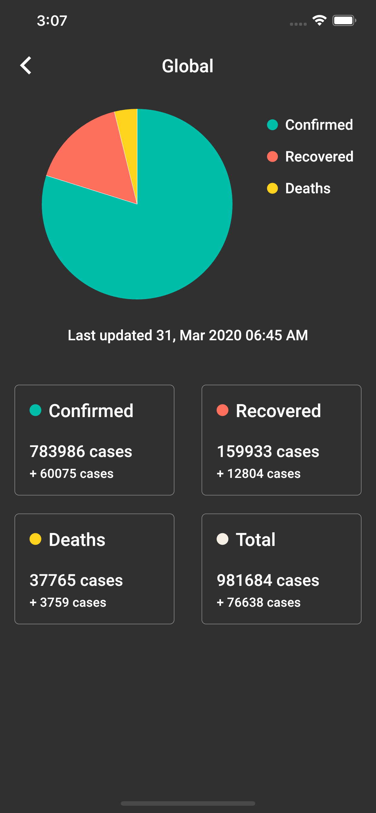
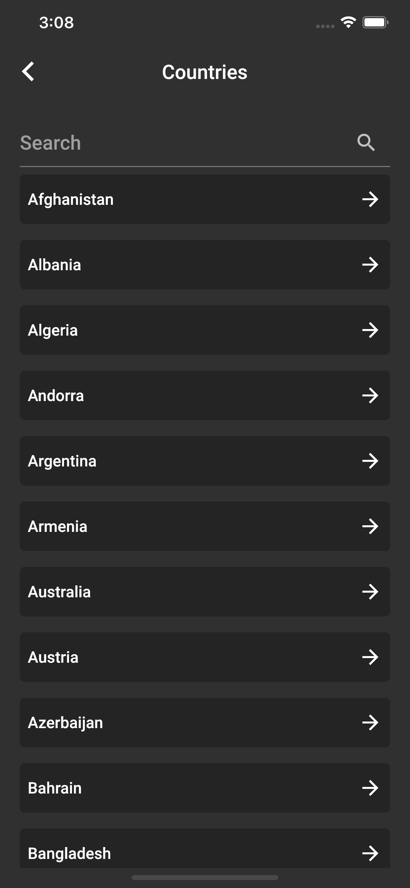
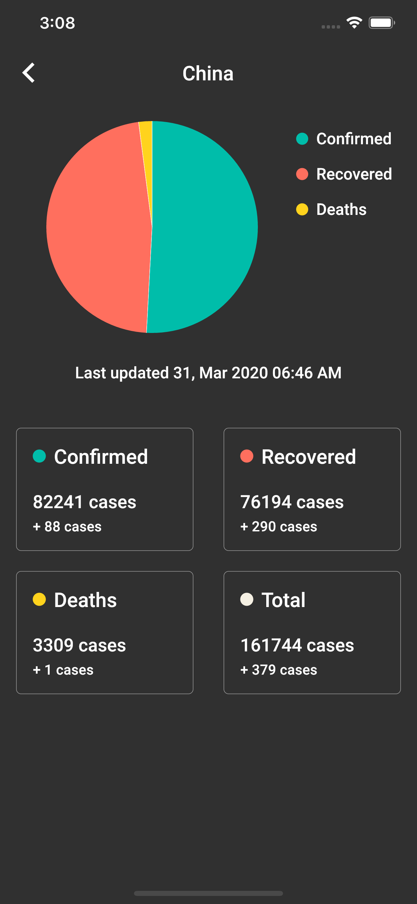
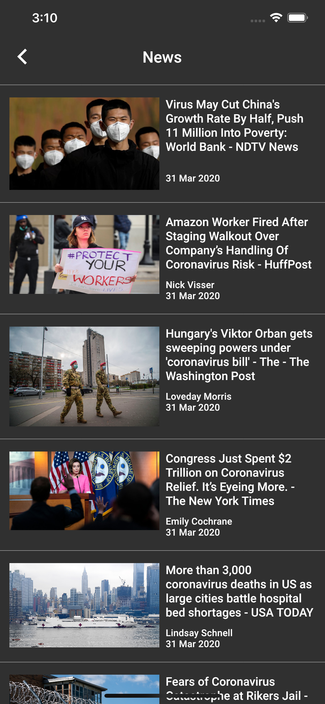
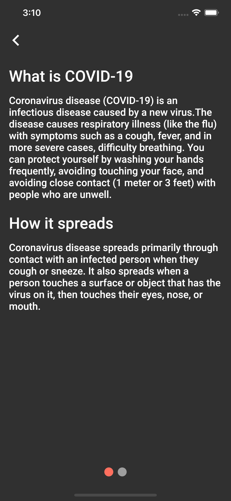
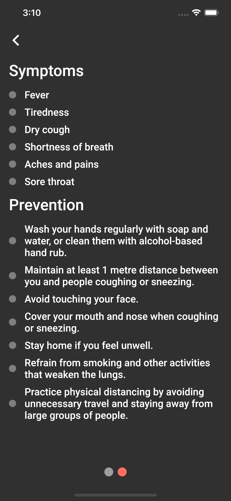

# COVID-19 Tracker

With the recent COVID-19 pandemic outbreak, I wanted to build an app that would allow me to track data about the situation.

COVID-19 data is retrieved from [Smartable](https://developer.smartable.ai) 

News articles are found from [News API](newsapi.org)

## TODO

* [x] Parse CSV Data (No longer in use)
* [x] Parse JSON data
* [x] Create objects to hold parsed data
* [x] Use Google Maps API for a map view and show markers with case data (no longer in use)
* [x] Learn and implement Provider Architecture
* [x] Learn Flutter Tab Bar (no longer in use)
* [x] Use Gridview (no longer in use)
* [x] Redesign UI
* [x] News Page
* [x] Open web page when user chooses article
* [x] Info Page
* [x] Countries Page
* [x] Learn how to use routes for navigation to new pages
* [x] Handle screens when api fetch may fail
* [x] Use text field to allow for filtering in countries page
* [x] Refactor stats page to allow passing global data and country specific data
* [x] Use page view for the info screen
* [x] Implement a page indicator 
* [x] Saving devices to backend using firebase
* [x] Learn how to write firebase cloud functions with Typescript
* [x] Cron scheduler for daily notifications
* [x] Send a notification to all devices daily using cloud functions
* [ ] Cache news and countries specific data 

## Pages

### Home Page

### Global Stats Page

### Countries Page

### Country Stats Page

### News Page

### Info Page

## Packages Used

* [Flutter Provider](https://pub.dev/packages/provider)

* [Flutter SpinKit](https://pub.dev/packages/flutter_spinkit)

* [Flutter Charts](https://pub.dev/packages/charts_flutter)

* [Google Maps API](https://pub.dev/packages/google_maps_flutter)

* [Flutter HTTP for HTTP requests](https://pub.dev/packages/http)

* [CSV (Package for parsing csv files)](https://pub.dev/packages/csv)

* [Firebase Messaging](https://pub.dev/packages/firebase_messaging)

* [Firebase Firestore](https://pub.dev/packages/cloud_firestore) 

* [Smooth Page Indicator](https://pub.dev/packages/smooth_page_indicator)

* [URL Launcher](https://pub.dev/packages/url_launcher)

## Challenges Faced

* Refactoring app to parse api instead of parsing CSV file

* Learning how to use different packages for my use case

* Figuring out a way to allow multiple pages to use data from http call without having to pass entire data object to each Widget

* Building charts to represent data from API

* Designing User Interface

* Learning Provider Architecture

## Bugs

* Due to asynchronous calls, values would be null at run-time which resulted in errors or crashes (Fixed)

* Bug occurred when assigning null to string when parsing json (Fixed)

* Bug occurs where app is stuck in loading state if the app is opened without connection and then eventually connects (Fixed)

