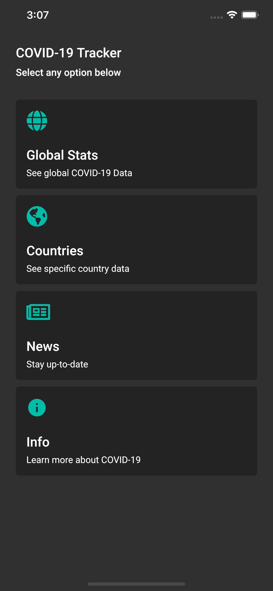
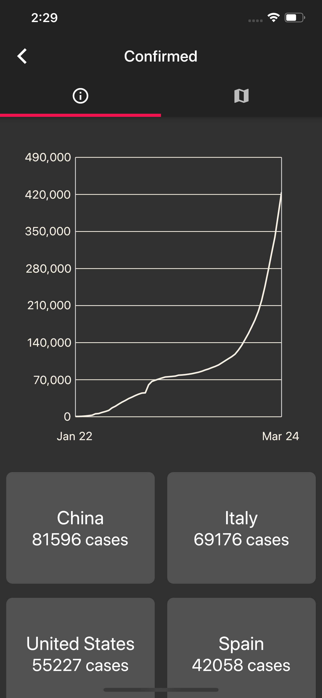
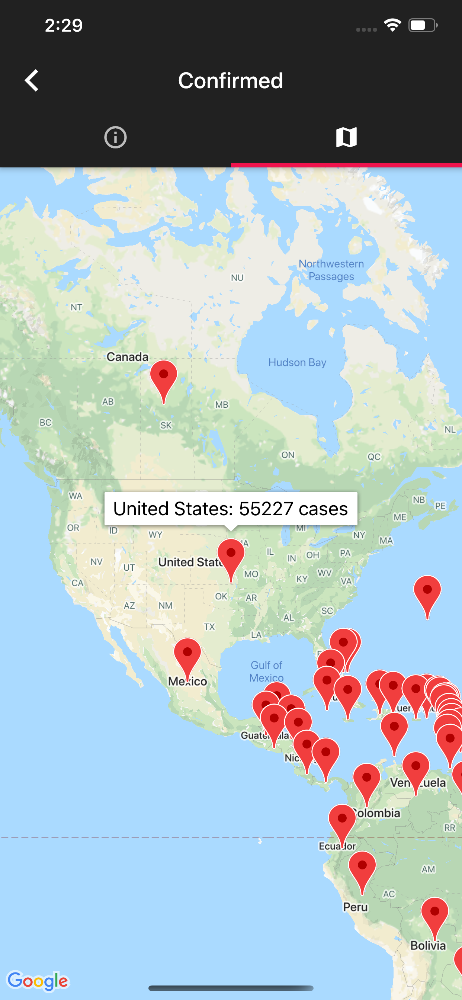

# COVID-19 Tracker

With the recent COVID-19 pandemic outbreak, I wanted to build an app that would allow me to track data about the situation.

COVID-19 data is retrieved from [Smartable](https://developer.smartable.ai) 

## Usage

1. Create an Google Maps api key and enable it for iOS and android.
2. Clone the repository.
3. Enter the api key inside the AndroidManifest and AppDelegate files

-------

## Screenshots

 

## Tools learned

* Parsing CSV data in Flutter to objects

* Parsing JSON in Flutter to objects

* How to use google maps api and show markers that corresponding 

* Flutter Provider Architecture

* Flutter Tab Bars

* Flutter GridView

* Creating charts in Flutter

* Asynchronous programming with network calls

* Building objects to store data

* Using Flutter routes to navigate to different screens/pages

* Handling screens for different connection states 

## Possible Additions 

* News feed on COVID-19 data

* Implement map page which shows markers and presents corresponding data  

* Firebase backend for push notifications

* Cron scheduling for daily notifications

* Implementing search on details page

* Caching data

* Use StreamProvider instead of FutureProvider to listen to network changes

* Continue to redesign

## Technologies Used

* [Flutter Provider](https://pub.dev/packages/provider)

* [Flutter SpinKit](https://pub.dev/packages/flutter_spinkit)

* [Flutter Charts](https://pub.dev/packages/charts_flutter)

* [Google Maps API](https://pub.dev/packages/google_maps_flutter)

* [Flutter HTTP for HTTP requests](https://pub.dev/packages/http)

* [CSV (Package for parsing csv files)](https://pub.dev/packages/csv) (No longer in use due to using API instead now)

## Challenges Faced

* Figuring out a way to allow multiple pages to use data from http call without having to pass entired data object to each Widget

* Building charts to represent data from API

* Designing User Interface

* Learning Provider Architecture

## Bugs

* Due to asynchronous calls, values would be null at run-time which resulted in errors or crashes (Fixed)

* Bug occurs where app is stuck in loading state if the app is opened without connection and then eventually connects (Fixed)

